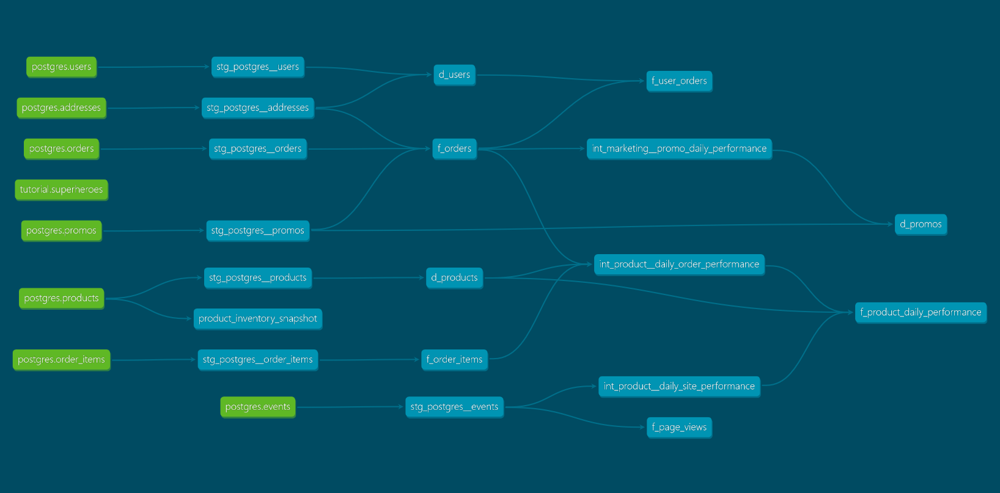

# Data models

## What is our repeat rate?

```
select sum(case when n_orders > 1 then 1 else 0 end)/count(*) as repeat_rate 
from dev_db.dbt_fangxianfugmailcom.f_user_orders
```

Answer: 0.798387

## What are good indicators of a user who will likely purchase again? What about indicators of users who are likely NOT to purchase again? If you had more data, what features would you want to look into to answer this question?

Some ideas for things that make influence future purchases:

* Number of purchases and amount spent
* Whether deliveries arrive on time, whether deliveries are slow
* Whether they used promos, and perhaps which promos
* How long they spend browsing (may be negative or positive)
* Product is in stock, or product has low stock
* Users with abandoned carts

With more data I would want to look further at the user funnel: do they need to make an account, do they need to verify email etc. Which of these steps is causing friction and which users come back after hitting those steps and failing once? Is our abandoned cart prevention working?

## Explain the product mart models you added. Why did you organize the models in the way you did?

There are three mart folders:

* **Core:** This mart contains fairly thin interfaces to the staging tables that are reused frequently. Some views include joins to add more context to the row, but no KPIs, aggregations, or joins that increase the number of rows over the staging table are performed in Core at present.
* **Marketing:** This mart contains 
  - A dimension model of promotions that includes some promotion-level KPIs ([d_promos](https://github.com/mw-stanley/course-dbt/blob/main/greenery/models/marts/marketing/d_promos.sql)). These KPIs aren't likely to be incredibly useful in the real world but adding them was easy and it may prove useful for monitoring. 
  - An intermediate model of daily promo performance KPIs ([int_marketing__promo_daily_performance](https://github.com/mw-stanley/course-dbt/blob/main/greenery/models/marts/marketing/intermediate/int_marketing__promo_daily_performance.sql)), which I am imagining would form one component of a cost-benefit analysis of promotions. This model provides the benefit part and I imagine another intermediate model summarising the promo-level costs, and then a model that outputs daily cost-benefit performance KPIs for promos.
* **Product:** This mart contains
  - A fact model of page views (mentioned in the project materials but not used for anything further at this stage) ([f_page_views](https://github.com/mw-stanley/course-dbt/blob/main/greenery/models/marts/product/f_page_views.sql))
  - A fact model of daily product performance which combines day-grain data from ([f_product_daily_performance](https://github.com/mw-stanley/course-dbt/blob/main/greenery/models/marts/product/f_product_daily_performance.sql))
    - An intermediate model of daily-grain order performance ([int_product__daily_order_performance](https://github.com/mw-stanley/course-dbt/blob/main/greenery/models/marts/product/intermediate/int_product__daily_order_performance.sql)). This is separate because I imagine it will be re-used.
    - An intermediate model of daily-grain site performance ([int_product__daily_site_performance](https://github.com/mw-stanley/course-dbt/blob/main/greenery/models/marts/product/intermediate/int_product__daily_site_performance.sql)). This is separate because I imagine it will be re-used.
  - A fact model summarising some order KPIs at the user grain ([f_user_orders](https://github.com/mw-stanley/course-dbt/blob/main/greenery/models/marts/product/f_user_orders.sql))

## Paste in an image of your DAG from the docs.



# Tests

## What assumptions are you making about each model? (i.e. why are you adding each test?)

I added a few standard tests to the staging models:

* Uniqueness where applicable
* Not null where applicable
* Relational integrity tests to foreign keys
* created_at and updated_at dates should always be in the past
* dollar amounts should be positive
* delivery should always happen after an order takes place
* order item quantities should be positive
* product inventory amounts should be positive
* in the events table, order-related events should have an order id and product_related events a product id
* in the events table, each session should have only one user

For my core models, these are thin interfaces over staging so where I have done joins, I verify that these have not fanned out but otherwise there's nothing else to test.

For intermediate models and final models, I continue to check referential integrity, check for fan-outs on joins, and check that calculated columns have calculated correctly. Where I have aggregated, I check that I have fewer rows than the source.

## Did you find any “bad” data as you added and ran tests on your models? How did you go about either cleaning the data in the dbt model or adjusting your assumptions/tests?

Yes - in the orders, the cost plus shipping doesn't always equal the total. To correct this, we'd have to work with the team behind the upstream data to figure out why this is and then make a business decision about how to proceed (eg override incorrect totals with a calculated total).

## Explain how you would ensure these tests are passing regularly and how you would alert stakeholders about bad data getting through.

Use `dbt build` or `dbt test` alongside regular refreshes of the model. With `dbt build`, tests fail "safely" and stop bad data continuing into models - if `dbt build` is undesirable, the models could be configured to run as a series of steps using Airflow or similar.

If this process identifies a data problem, or if a data problem is identified later, the communication should include why the error happened, how it was rectified, and what has been done to stop it happening again (ie tests added to catch the error, code added to heal up bad data).

# Snapshots

The following plants had their inventory change:

* Pothos
* Philodendron
* Monstera
* String of pearls

```
select distinct name from product_inventory_snapshot where dbt_valid_to is not null
```